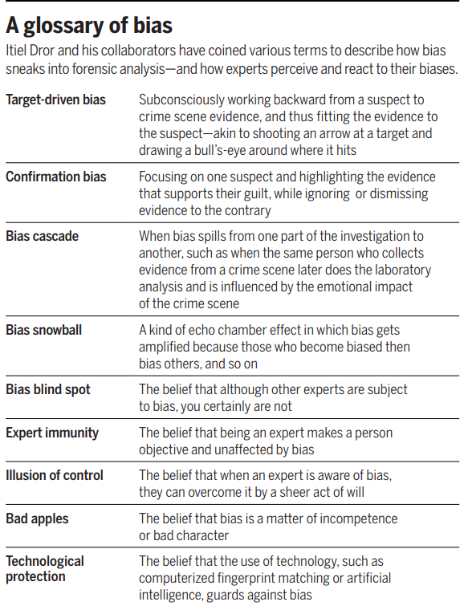

1. J&J vaccine
thrombosis with thrombocytopenia syndrome (TTS), a rare, serious clotting disorder that has been associated with the vaccine. FDA has confirmed 60 cases of TTS, nine of them fatal, after 18.7 million doses of J&J were administered. The vaccine’s benefits still outweigh the risks, the agency says but alternatives that don’t cause TTS are readily available.

2. Cause of death in pig's heart transplanted patient might not be the immune rejection but porcine cytomegalovirus

3. Lipid as a delivery system for mRNA vaccines
    1. The technology was key to the success of COVID-19 shots from Moderna and the Pfizer-BioNTech collaboration. 
    2. they were first developed to carry gene silencing drugs inside the cell
    2. limitations
        1. side effects
        2. poor job of unloading the cargo inside the cell
        3. tend to fall apart when warm so require very low temperature
    2. side effects of lipid nanoparticles
        1. when they spread through the body, triggering the aches and inflammation many people experience after vaccination. 

4. highly pathogenic H5N1 strain of avial flu in Europe
5. cognitive psychologist Itiel Dror suggests that forensic community is more baised and suggested some biases 
    1. Autopsy of a crime lab: exposing the flaws in forensics, which discuss about flawed practices in forensic science by Brandon Garrett
    2. a small experiment by dror:
        1. infamous FBI's mismatch of Mayfields's prints with terrorists's: where they found five fingerprint experts
who knew about the Mayfield case but had
not seen the fingerprints. Dror and Charlton
sent each expert a pair of prints from one of
the expert’s own previous cases, which they
had personally verified as “matched,” but told
them the prints came from the notorious case
of FBI’s mismatch of Mayfield’s prints with
the terrorist’s.
Four of the five experts contradicted
their previous decision: Three now concluded the pair was a mismatch, and one
felt he needed more information. They
seemed to have been influenced by the passage of time and extraneous information
    3. Consider the case of Kerry Robinson in Georgia, who was accused in 2002 of
taking part in a gang rape. The state based
its case on the plea bargain testimony of
Tyrone White, who investigators had identified as the main perpetrator and who bore
Robinson a grudge. The state’s two DNA experts found that Robinson’s DNA “could not
be excluded,” from the mixture of DNA
found at the crime scene, and the jury
found him guilty. Greg Hampikian, a genetics professor
then at the Georgia Innocence Project,
sent DNA data from the case to Dror, who
shared it with 17 DNA analysts unfamiliar
with the case. Only one agreed with Georgia’s analysts; the other 16 either excluded
Robinson’s DNA or said they could not come
up with a result. Dror’s conclusion: Even
DNA analysis, the “gold standard” of forensic science, was subject to human bias. The
state did not release Robinson until 2020,
when Hampikian submitted other exonerating information. Robinson had already
served 18 years of his 20-year sentence.
    4. see the bias they termed 
